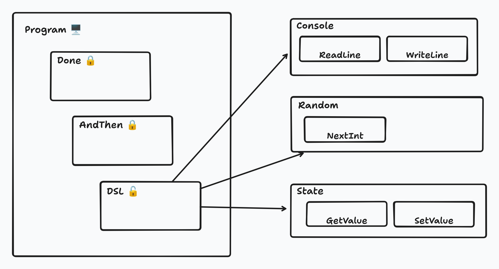

# Construyendo DSLs en Java

Aprovechando las nuevas herramientas del lenguaje

<!-- _color: #fff -->
<!-- _footer: _Antonio Muñoz_ -->
<!-- _backgroundImage: url('images/frontpage.png') -->

---

# 쯈uien soy?

* Programo en Java desde Java 1.1.
* Actualmente trabajo en https://clarity.ai como backender.
* Me encontraréis en:
    - Mastodon: https://jvm.social/@tonivade
    - Github: https://github.com/tonivade
    - Blog: https://blog.tonivade.es
    - Email: me@tonivade.es

---

# JMAD

17 de Mayo de 2025.


https://jmad.madridjug.es/tickets

---

# Empecemos por el principio

* Qué es un DSL?
* Domain Specific Language.
* Está especializado para un dominio específico.

---

# Ventajas

* Vocabulario reducido.
* Sintaxis concisa.
* Mayor expresividad.
* Mayor productividad.

---

# Tipos de DSLs

* Externos.
* Internos o embebidos.

---

# DSLs externos

* Están implementados con un interprete/compilador independiente.
* Ejemplos: Gherkin, SQL, HTML.
* Más complejos de implementar.
* Pero más potentes.

---

# Gherkin

```gherkin
Feature:  Login functionality of social networking site Mastodon. 
Given:  I am a mastodon user. 
When: I enter username as username. 
And I enter the password as the password 
Then I should be redirected to the home page of mastodon
```

---

# SQL

```sql
select 
  people.name, 
  people.age 
from people 
where people.age > 18 
order by people.age ASC
```

---

# HTML

```html
<html>
  <head>
    <title>Example</title>
  </head>
  <body>
    <h1>Hello World</h1>
  </body>
</html>
```

---

# DSLs internos

* Están implementados como parte del propio lenguaje donde se van a usar.
* Más sencillos de implementar.
* Están limitados a las capacidades del lenguaje anfitrión.

---

# DSLs internos (II)

* Hay dos tipos de DSLs internos:
  * Estáticos
    * Ejemplos: JOOQ, Assertj.
  * Dinámicos
    * Ejemplos: Gradle.

---

# De qué voy a hablar hoy?

* Un breve resumen de las novedades más relevantes en Java:
  * Records.
  * Pattern matching.
  * Sealed interfaces.
* DSLs internos estáticos implementados en Java. Muy brevemente.
* DSLs internos dinámicos implementados en Java. Más extensamente.

---

# Records

* Introducido en Java 16.
* Inmutables.
* Constructor canónico.

---

# Records (II)

```java
public record Movie(String title, int year, int duration) {
}
```

* `equals()`
* `hashcode()`
* `toString()`

---

# Sealed interfaces

* Introducido en Java 17.
* Jerarquías de clases cerradas.
* `non-sealed`

---

# Sealed interfaces (II)

```java
public sealed interface Shape {
  record Square(int side) implements Shape {}
  record Rectangle(int weight, int height) implements Shape {}
  record Circle(int radius) implements Shape {}
}
```

---

# Pattern Matching for Switch

* Introducido en Java 21.
* Deconstructores, nos permiten acceder a los componentes internos.
* Exhaustiveness.

---

# Pattern Matching for Switch (II)

```java
var area = switch (this) {
    case Square(var side) -> side * side;
    case Rectangle(var weight, var height) -> weight * height;
    case Circle(var radius) -> Math.PI * Math.pow(radius, 2);
};
```

---

# Más información

Mi [charla del año pasado](https://www.youtube.com/watch?v=RbLkJXagQXw).

---

# Un DSL sencillo

* Para generar queries SQL.

---

# Un DSL sencillo

```java
sealed interface SqlDsl {
  interface Table {
    String name();
  }
}
```

---

# Un DSL sencillo

```java
sealed interface SqlDsl {
  sealed interface Field<T> {}
  record Value<T>(T value) implements Field<T> {}
  record TableField<T>(String table, String name) implements Field<T> {}
}
```

---

# Un DSL sencillo

```java
sealed interface SqlDsl {
  sealed interface Filter<T> {}
  record Equal<T>(Field<T> left, Field<T> right) implements Filter<T> {}
  record GreaterThan<T>(Field<T> left, Field<T> right) implements Filter<T> {}
  record LessThan<T>(Field<T> left, Field<T> right) implements Filter<T> {}
}
```

---

# Un DSL sencillo

```java
sealed interface SqlDsl {
  sealed interface Sorting<T> {}
  record Ascending<T>(Field<T> field) implements Sorting<T> {}
  record Descending<T>(Field<T> field) implements Sorting<T> {}
}
```

---

# Un DSL sencillo

```java
sealed interface SqlDsl {
  record Query(
      List<Field<?>> fields,
      Table table,
      List<Filter<?>> filters,
      List<Sorting<?>> sorting) {
  }
}
```

---

# Un DSL sencillo

```java
sealed interface SqlDsl {
  record Query(
      List<Field<?>> fields,
      Table table,
      List<Filter<?>> filters,
      List<Sorting<?>> sorting) {

    Query from(Table table) {
      return new Query(fields, table, filters, sorting);
    }
  }
}
```

---

# Un DSL sencillo

```java
sealed interface SqlDsl {
  record Query(
      List<Field<?>> fields,
      Table table,
      List<Filter<?>> filters,
      List<Sorting<?>> sorting) {

    Query where(Filter<?>... filters) {
      return new Query(fields, table, List.of(filters), sorting);
    }
  }
}
```

---

# Un DSL sencillo

```java
sealed interface SqlDsl {
  record Query(
      List<Field<?>> fields,
      Table table,
      List<Filter<?>> filters,
      List<Sorting<?>> sorting) {

    Query sorting(Sorting<?>... sorting) {
      return new Query(fields, table, filters, List.of(sorting));
    }
  }
}
```

---

# Un DSL sencillo

```java
sealed interface SqlDsl {
  static Query select(Field<?>... fields) {
    return new Query(List.of(fields), null, null, null);
  }
}
```

---

# Un DSL sencillo

```java
sealed interface SqlDsl {
  static <T> Field<T> field(String table, String name) {
    return new TableField<>(table, name);
  }
  static <T> Field<T> value(T value) {
    return new Value<>(value);
  }
}
```

---

# Un DSL sencillo

```java
sealed interface SqlDsl {
  static <T> Filter<T> eq(Field<T> field, T value) {
    return new Equal<>(field, value(value));
  }
  static <T> Filter<T> gt(Field<T> field, T value) {
    return new GreaterThan<>(field, value(value));
  }
  static <T> Filter<T> lt(Field<T> field, T value) {
    return new LessThan<>(field, value(value));
  }
}
```

---

# Un DSL sencillo

```java
sealed interface SqlDsl {
  static <T> Sorting<T> asc(Field<T> field) {
    return new Ascending<>(field);
  }
  static <T> Sorting<T> desc(Field<T> field) {
    return new Descending<>(field);
  }
}
```

---

# Un DSL sencillo

```java
sealed interface SqlDsl {
  final class People implements Table {

    final Field<String> NAME = field("people", "name");
    final Field<Integer> AGE = field("people", "age");

    public String name() {
      return "people";
    }
  }
}
```

---

# Un DSL sencillo

```java
sealed interface SqlDsl {
  static void main(String... args) {
    var PEOPLE = new People();

    var query = select(PEOPLE.NAME, PEOPLE.AGE)
        .from(PEOPLE)
        .where(gt(PEOPLE.AGE, 18))
        .sorting(asc(PEOPLE.AGE));

    System.console().println(query.toSql());
  }
}
```

---

# Un DSL sencillo (II)

```java
sealed interface SqlDsl {
  record Query(...) {
    String toSql() {
      // ... a lot of boring code
    }
  }
}
```

---

# Un DSL sencillo (II)

```java
sealed interface SqlDsl {
  sealed interface Field<T> {
    default String toSql() {
      return switch (this) {
        case Value(var value) -> String.valueOf(value);
        case TableField(var table, var name) -> table + "." + name;
      };
    }
  }
}
```

---

# Un DSL sencillo (II)

```java
sealed interface SqlDsl {
  sealed interface Filter<T> {
    default String toSql() {
      return switch (this) {
        case Equal(var left, var right) -> left.toSql() + " = " + right.toSql();
        case GreaterThan(var left, var right) -> left.toSql() + " > " + right.toSql();
        case LessThan(var left, var right) -> left.toSql() + " < " + right.toSql();
      };
    }
  }
}
```

---

# Un DSL sencillo (II)

```java
sealed interface SqlDsl {
  sealed interface Sorting<T> {
    default String toSql() {
      return switch (this) {
        case Ascending(var field) -> field.toSql() + " asc";
        case Descending(var field) -> field.toSql() + " desc";
      };
    }
  }
}
```

---

# Un DSL sencillo (II)

```sql
select people.name, people.age from people where people.age > 18 order by people.age asc
```

---

# Un DSL más dinámico

* Que permita:
  * escribir en pantalla.
  * leer de consola.
* Combinar estas operaciones para hacer programas.

---

# Un programa muy sencillo

---

# Un programa muy sencillo

```bash {1}
# What's your name?


```

---

# Un programa muy sencillo

```bash {2}
# What's your name?
Toni

```

---

# Un programa muy sencillo

```bash {3}
# What's your name?
Toni
# Hello Toni!
```

---

# Un programa muy sencillo (III)

```java
sealed interface Console {
}
```

---

# Un programa muy sencillo (III)

```java {2}
sealed interface Console {
  record WriteLine(String line) implements Console {}
}
```

---

# Un programa muy sencillo (III)

```java {3}
sealed interface Console {
  record WriteLine(String line) implements Console {}
  record ReadLine() implements Console {}
}
```

---

# Primer Intento

Usando CPS. Continuation Passing Style.

```java
sealed interface ConsoleCps {
  record WriteLine(String line) implements ConsoleCps {}
  record ReadLine() implements ConsoleCps {}
}
```

<!--
Continuation Passing Style es solución muy utilizada, y en muchos compiladores se usa como representación interna.
 -->

---

# Primer Intento

Usando CPS. Continuation Passing Style.

```java {2}
sealed interface ConsoleCps {
  record WriteLine(String line, ConsoleCps next) implements ConsoleCps {}
  record ReadLine() implements ConsoleCps {}
}
```

---

# Primer Intento

Usando CPS. Continuation Passing Style.

```java {3}
sealed interface ConsoleCps {
  record WriteLine(String line, ConsoleCps next) implements ConsoleCps {}
  record ReadLine(Function<String, ConsoleCps> next) implements ConsoleCps {}
}
```

---

# Primer Intento (II)

```java {2-3}
sealed interface ConsoleCps {
  static void main() {
  }
}
```

---

# Primer Intento (II)

```java {3}
sealed interface ConsoleCps {
  static void main() {
    new WriteLine("What's your name?");
  }
}
```

---

# Primer Intento (II)

```java {3}
sealed interface ConsoleCps {
  static void main() {
    new WriteLine("What's your name?", ???);
  }
}
```

---

# Primer Intento (II)

```java {4}
sealed interface ConsoleCps {
  static void main() {
    new WriteLine("What's your name?", 
      new ReadLine());
  }
}
```

---

# Primer Intento (II)

```java {4}
sealed interface ConsoleCps {
  static void main() {
    new WriteLine("What's your name?", 
      new ReadLine(???));
  }
}
```

---

# Primer Intento (II)

```java {5}
sealed interface ConsoleCps {
  static void main() {
    new WriteLine("What's your name?", 
      new ReadLine(
        name -> new WriteLine("Hello " + name + "!")));
  }
}
```

---

# Primer Intento (II)

```java {5}
sealed interface ConsoleCps {
  static void main() {
    new WriteLine("What's your name?", 
      new ReadLine(
        name -> new WriteLine("Hello " + name + "!", ???)));
  }
}
```

---

# Primer Intento (II)

```java {6}
sealed interface ConsoleCps {
  static void main() {
    new WriteLine("What's your name?", 
      new ReadLine(
        name -> new WriteLine("Hello " + name + "!", 
          new End())));
  }
}
```

---

# Primer Intento (II)

Tenemos que añadir otro caso para terminar la ejecución:

```java {4}
sealed interface ConsoleCps {
  record WriteLine(String line, ConsoleCps next) implements ConsoleCps {}
  record ReadLine(Function<String, ConsoleCps> next) implements ConsoleCps {}
  record End() implements ConsoleCps {}
}
```

---

# Primer Intento (III)

```java {3}
sealed interface ConsoleCps {
  static ConsoleCps prompt(String question, Function<String, ConsoleCps> next) {
    return new WriteLine(question, new ReadLine(next));
  }
}
```

---

# Primer Intento (III)

```java {3}
sealed interface ConsoleCps {
  static void main() {
    prompt("What's your name?", 
      name -> new WriteLine("Hello " + name + "!", new End()));
  }
}
```

---

# Primer Intento (III)

```java {3}
sealed interface ConsoleCps {
  static ConsoleCps sayHello(String name) {
    return new WriteLine("Hello " + name + "!", new End());
  }
}
```

---

# Primer Intento (III)

```java {3}
sealed interface ConsoleCps {
  static void main() {
    prompt("What's your name?", ConsoleCps::sayHello);
  }
}
```

---

# Primer Intento (IV)

Ahora es el momento de evaluar el programa.

```java {5}
sealed interface ConsoleCps {
  static void main() {
    var program = prompt("What's your name?", ConsoleCps::sayHello);

    program.eval();
  }
}
```

---

# Primer Intento (IV)

```java
sealed interface ConsoleCps {
  default String eval() {
    return switch (this) {
    };
  }
}
```

---

# Primer Intento (IV)

```java {4-7}
sealed interface ConsoleCps {
  default String eval() {
    return switch (this) {
      case WriteLine(var line, var next) -> {
        System.console().println(line);
        yield next.eval();
      }
    };
  }
}
```

---

# Primer Intento (IV)

```java {6}
sealed interface ConsoleCps {
  default String eval() {
    return switch (this) {
      case WriteLine(var line, var next) -> {
        System.console().println(line);
        yield next.eval();
      }
    };
  }
}
```

---

# Primer Intento (IV)

```java {8-11}
sealed interface ConsoleCps {
  default String eval() {
    return switch (this) {
      case WriteLine(var line, var next) -> {
        System.console().println(line);
        yield next.eval();
      }
      case ReadLine(var next) -> {
        var line = System.console().readLine();
        yield next.apply(line).eval();
      }
    };
  }
}
```

---

# Primer Intento (IV)

```java {10}
sealed interface ConsoleCps {
  default String eval() {
    return switch (this) {
      case WriteLine(var line, var next) -> {
        System.console().println(line);
        yield next.eval();
      }
      case ReadLine(var next) -> {
        var line = System.console().readLine();
        yield next.apply(line).eval();
      }
    };
  }
}
```

---

# Primer Intento (IV)

```java {12}
sealed interface ConsoleCps {
  default String eval() {
    return switch (this) {
      case WriteLine(var line, var next) -> {
        System.console().println(line);
        yield next.eval();
      }
      case ReadLine(var next) -> {
        var line = System.console().readLine();
        yield next.apply(line).eval();
      }
      case End _ -> null;
    };
  }
}
```

---

# Primer Intento (V)


---

# Otro Intento

Usando otro estilo.

```java
sealed interface ConsoleDsl {
}
```

---

# Otro Intento

Usando otro estilo.

```java
sealed interface ConsoleDsl {
  record WriteLine(String line) implements ConsoleDsl {}
  record ReadLine() implements ConsoleDsl {}
}
```

---

# Otro Intento

Usando otro estilo.

```java {4}
sealed interface ConsoleDsl {
  record WriteLine(String line) implements ConsoleDsl {}
  record ReadLine() implements ConsoleDsl {}
  record AndThen() implements ConsoleDsl {}
}
```

---

# Otro Intento

Usando otro estilo.

```java {4}
sealed interface ConsoleDsl {
  record WriteLine(String line) implements ConsoleDsl {}
  record ReadLine() implements ConsoleDsl {}
  record AndThen(???) implements ConsoleDsl {}
}
```

---

# Otro Intento

Usando otro estilo.

```java {5}
sealed interface ConsoleDsl {
  record WriteLine(String line) implements ConsoleDsl {}
  record ReadLine() implements ConsoleDsl {}
  record AndThen(
    ConsoleDsl current) 
      implements ConsoleDsl {}
}
```

---

# Otro Intento

Usando otro estilo.

```java {6}
sealed interface ConsoleDsl {
  record WriteLine(String line) implements ConsoleDsl {}
  record ReadLine() implements ConsoleDsl {}
  record AndThen(
    ConsoleDsl current,
    Function<String, ConsoleDsl> next) 
      implements ConsoleDsl {}
}
```

---

# Otro Intento (II)

```java {3}
sealed interface ConsoleDsl {
  static void main() {
    new WriteLine("What's your name?");
  }
}
```

---

# Otro Intento (II)

```java {4}
sealed interface ConsoleDsl {
  static void main() {
    new AndThen(
      new WriteLine("What's your name?"), _ -> new ReadLine());
  }
}
```

---

# Otro Intento (II)

```java {3,7}
sealed interface ConsoleDsl {
  static void main() {
    new AndThen(
      new AndThen(
        new WriteLine("What's your name?"), 
        _ -> new ReadLine()), 
      name -> new WriteLine("Hello " + name + "!"));
  }
}
```

---

# Otro Intento (III)

```java {3}
sealed interface ConsoleDsl {
  default ConsoleDsl andThen(Function<String, ConsoleDsl> next) {
    return new AndThen(this, next);
  }
}
```

---

# Otro Intento (III)

```java {3}
sealed interface ConsoleDsl {
  static void main() {
    new WriteLine("What's your name?");
  }
}
```

---

# Otro Intento (III)

```java {4}
sealed interface ConsoleDsl {
  static void main() {
    new WriteLine("What's your name?")
      .andThen(_ -> new ReadLine());
  }
}
```

---

# Otro Intento (III)

```java {5}
sealed interface ConsoleDsl {
  static void main() {
    new WriteLine("What's your name?")
      .andThen(_ -> new ReadLine())
      .andThen(name -> new WriteLine("Hello " + name + "!"));
  }
}
```

---

# Otro Intento (III)

```java
sealed interface ConsoleDsl {
  static ConsoleDsl prompt(String question) {
    return new WriteLine(question).andThen(_ -> new ReadLine());
  }
}
```

---

# Otro Intento (III)

```java {3}
sealed interface ConsoleDsl {
  static void main() {
    prompt("What's your name?")
      .andThen(name -> new WriteLine("Hello " + name + "!"));
  }
}
```

---

# Otro Intento (III)

```java
sealed interface ConsoleDsl {
  static ConsoleDsl sayHello(String name) {
    return writeLine("Hello " + name + "!");
  }
}
```

---

# Otro Intento (IV)

```java {4}
sealed interface ConsoleDsl {
  static void main() {
    prompt("What's your name?")
      .andThen(ConsoleDsl::sayHello);
  }
}
```

---

# Otro Intento (V)

Ahora es el momento de evaluar el programa.

```java {6}
sealed interface ConsoleDsl {
  static void main() {
    var program = prompt("What's your name?")
      .andThen(ConsoleDsl::sayHello);

    program.eval();
  }
}
```

---

# Otro Intento (V)

```java
sealed interface ConsoleDsl {
  default String eval() {
    return switch (this) {
    };
  }
}
```

---

# Otro Intento (V)

```java {4-7}
sealed interface ConsoleDsl {
  default String eval() {
    return switch (this) {
      case WriteLine(var line) -> {
        System.console().println(line);
        yield null;
      }
    };
  }
}
```

---

# Otro Intento (V)

```java {8}
sealed interface ConsoleDsl {
  default String eval() {
    return switch (this) {
      case WriteLine(var line) -> {
        System.console().println(line);
        yield null;
      }
      case ReadLine _ -> System.console().readLine();
    };
  }
}
```

---

# Otro Intento (V)

```java {9-10}
sealed interface ConsoleDsl {
  default String eval() {
    return switch (this) {
      case WriteLine(var line) -> {
        System.console().println(line);
        yield null;
      }
      case ReadLine _ -> System.console().readLine();
      case AndThen(var current, var next) 
        -> next.apply(current.eval()).eval();
    };
  }
}
```

---

# Otro Intento (V)


---

# Un DSL más divertido

* Un juego sencillo.
* Adivinar un número entre 0 a 9.
* Añadir estado.

---

# Un DSL más divertido

```bash {1}
# Do you want to play a game? (y/n)
```

---

# Un DSL más divertido

```bash {2}
# Do you want to play a game? (y/n)
y
```

---

# Un DSL más divertido

```bash {3}
# Do you want to play a game? (y/n)
y
# Enter a number between 0 to 9
```

---

# Un DSL más divertido

```bash {4}
# Do you want to play a game? (y/n)
y
# Enter a number between 0 to 9
1
```

---

# Un DSL más divertido

```bash {5}
# Do you want to play a game? (y/n)
y
# Enter a number between 0 to 9
1
# Enter a number between 0 to 9
```

---

# Un DSL más divertido

```bash {6}
# Do you want to play a game? (y/n)
y
# Enter a number between 0 to 9
1
# Enter a number between 0 to 9
2
```

---

# Un DSL más divertido

```bash {7}
# Do you want to play a game? (y/n)
y
# Enter a number between 0 to 9
1
# Enter a number between 0 to 9
2
# YOU WIN!
```

---

# Un DSL más divertido (II)

```java
sealed interface GameDsl {
}
```

---

# Un DSL más divertido (II)

```java {2-3}
sealed interface GameDsl {
  record WriteLine(String line) implements GameDsl {}
  record ReadLine() implements GameDsl {}
}
```

---

# Un DSL más divertido (II)

```java {4}
sealed interface GameDsl {
  record WriteLine(String line) implements GameDsl {}
  record ReadLine() implements GameDsl {}
  record NextInt(int bound) implements GameDsl {}
}
```

---

# Un DSL más divertido (II)

```java {5-6}
sealed interface GameDsl {
  record WriteLine(String line) implements GameDsl {}
  record ReadLine() implements GameDsl {}
  record NextInt(int bound) implements GameDsl {}
  record GetValue() implements GameDsl {}
  record SetValue(int value) implements GameDsl {}
}
```

---

# Un DSL más divertido (II)

```java {7}
sealed interface GameDsl {
  record WriteLine(String line) implements GameDsl {}
  record ReadLine() implements GameDsl {}
  record NextInt(int bound) implements GameDsl {}
  record GetValue() implements GameDsl {}
  record SetValue(int value) implements GameDsl {}
  record AndThen() implements GameDsl {}
}
```

---

# Un DSL más divertido (II)

```java {7}
sealed interface GameDsl {
  record WriteLine(String line) implements GameDsl {}
  record ReadLine() implements GameDsl {}
  record NextInt(int bound) implements GameDsl {}
  record GetValue() implements GameDsl {}
  record SetValue(int value) implements GameDsl {}
  record AndThen(???) implements GameDsl {}
}
```

---

# Un DSL más divertido (II)

```java {8}
sealed interface GameDsl {
  record WriteLine(String line) implements GameDsl {}
  record ReadLine() implements GameDsl {}
  record NextInt(int bound) implements GameDsl {}
  record GetValue() implements GameDsl {}
  record SetValue(int value) implements GameDsl {}
  record AndThen(
    GameDsl current) 
      implements GameDsl {}
}
```

---

# Un DSL más divertido (II)

```java {8}
sealed interface GameDsl {
  record WriteLine(String line) implements GameDsl {}
  record ReadLine() implements GameDsl {}
  record NextInt(int bound) implements GameDsl {}
  record GetValue() implements GameDsl {}
  record SetValue(int value) implements GameDsl {}
  record AndThen(
    GameDsl current, ???) 
      implements GameDsl {}
}
```

---

# Un DSL más divertido (II)

```java {9}
sealed interface GameDsl {
  record WriteLine(String line) implements GameDsl {}
  record ReadLine() implements GameDsl {}
  record NextInt(int bound) implements GameDsl {}
  record GetValue() implements GameDsl {}
  record SetValue(int value) implements GameDsl {}
  record AndThen(
    GameDsl current, 
    Function<?, GameDsl> next) 
      implements GameDsl {}
}
```

---

# Un DSL más divertido (II)

```java {1}
sealed interface GameDsl<T> {
  record WriteLine(String line) implements GameDsl {}
  record ReadLine() implements GameDsl {}
  record NextInt(int bound) implements GameDsl {}
  record GetValue() implements GameDsl {}
  record SetValue(int value) implements GameDsl {}
  record AndThen(
    GameDsl current, 
    Function<?, GameDsl> next) 
      implements GameDsl {}
}
```

---

# Un DSL más divertido (II)

```java {2}
sealed interface GameDsl<T> {
  record WriteLine(String line) implements GameDsl<Void> {}
  record ReadLine() implements GameDsl {}
  record NextInt(int bound) implements GameDsl {}
  record GetValue() implements GameDsl {}
  record SetValue(int value) implements GameDsl {}
  record AndThen(
    GameDsl current, 
    Function<?, GameDsl> next) 
      implements GameDsl {}
}
```

---

# Un DSL más divertido (II)

```java {3}
sealed interface GameDsl<T> {
  record WriteLine(String line) implements GameDsl<Void> {}
  record ReadLine() implements GameDsl<String> {}
  record NextInt(int bound) implements GameDsl {}
  record GetValue() implements GameDsl {}
  record SetValue(int value) implements GameDsl {}
  record AndThen(
    GameDsl current, 
    Function<?, GameDsl> next) 
      implements GameDsl {}
}
```

---

# Un DSL más divertido (II)

```java {4}
sealed interface GameDsl<T> {
  record WriteLine(String line) implements GameDsl<Void> {}
  record ReadLine() implements GameDsl<String> {}
  record NextInt(int bound) implements GameDsl<Integer> {}
  record GetValue() implements GameDsl {}
  record SetValue(int value) implements GameDsl {}
  record AndThen(
    GameDsl current, 
    Function<?, GameDsl> next) 
      implements GameDsl {}
}
```

---

# Un DSL más divertido (II)

```java {5}
sealed interface GameDsl<T> {
  record WriteLine(String line) implements GameDsl<Void> {}
  record ReadLine() implements GameDsl<String> {}
  record NextInt(int bound) implements GameDsl<Integer> {}
  record GetValue() implements GameDsl<Integer> {}
  record SetValue(int value) implements GameDsl {}
  record AndThen(
    GameDsl current, 
    Function<?, GameDsl> next) 
      implements GameDsl {}
}
```

---

# Un DSL más divertido (II)

```java {6}
sealed interface GameDsl<T> {
  record WriteLine(String line) implements GameDsl<Void> {}
  record ReadLine() implements GameDsl<String> {}
  record NextInt(int bound) implements GameDsl<Integer> {}
  record GetValue() implements GameDsl<Integer> {}
  record SetValue(int value) implements GameDsl<Void> {}
  record AndThen(
    GameDsl current, 
    Function<?, GameDsl> next) 
      implements GameDsl {}
}
```

---

# Un DSL más divertido (II)

```java {7,10}
sealed interface GameDsl<T> {
  record WriteLine(String line) implements GameDsl<Void> {}
  record ReadLine() implements GameDsl<String> {}
  record NextInt(int bound) implements GameDsl<Integer> {}
  record GetValue() implements GameDsl<Integer> {}
  record SetValue(int value) implements GameDsl<Void> {}
  record AndThen<T>(
    GameDsl current, 
    Function<?, GameDsl> next) 
      implements GameDsl<T> {}
}
```

---

# Un DSL más divertido (II)

```java {8}
sealed interface GameDsl<T> {
  record WriteLine(String line) implements GameDsl<Void> {}
  record ReadLine() implements GameDsl<String> {}
  record NextInt(int bound) implements GameDsl<Integer> {}
  record GetValue() implements GameDsl<Integer> {}
  record SetValue(int value) implements GameDsl<Void> {}
  record AndThen<T>(
    GameDsl<T> current, 
    Function<?, GameDsl> next) 
      implements GameDsl<T> {}
}
```

---

# Un DSL más divertido (II)

```java {9}
sealed interface GameDsl<T> {
  record WriteLine(String line) implements GameDsl<Void> {}
  record ReadLine() implements GameDsl<String> {}
  record NextInt(int bound) implements GameDsl<Integer> {}
  record GetValue() implements GameDsl<Integer> {}
  record SetValue(int value) implements GameDsl<Void> {}
  record AndThen<T>(
    GameDsl<T> current, 
    Function<T, GameDsl<?>> next) 
      implements GameDsl<T> {}
}
```

---

# Un DSL más divertido (II)

```java {8-10}
sealed interface GameDsl<T> {
  record WriteLine(String line) implements GameDsl<Void> {}
  record ReadLine() implements GameDsl<String> {}
  record NextInt(int bound) implements GameDsl<Integer> {}
  record GetValue() implements GameDsl<Integer> {}
  record SetValue(int value) implements GameDsl<Void> {}
  record AndThen<X, T>(
    GameDsl<X> current, 
    Function<X, GameDsl<T>> next) 
      implements GameDsl<T> {}
}
```

---

# Un DSL más divertido (III)

```java {3}
sealed interface GameDsl<T> {
  static void main() {
    prompt("Do you want to play a game? (y/n)");
  }
}
```

---

# Un DSL más divertido (III)

```java {4-9}
sealed interface GameDsl<T> {
  static void main() {
    prompt("Do you want to play a game? (y/n)")
      .andThen(answer -> {
        if (answer.equalsIgnoreCase("y")) {
          return ???;
        }
        return ???;
      });
  }
}
```

---

# Un DSL más divertido (III)

```java {8}
sealed interface GameDsl<T> {
  static void main() {
    prompt("Do you want to play a game? (y/n)")
      .andThen(answer -> {
        if (answer.equalsIgnoreCase("y")) {
          return ???;
        }
        return new WriteLine("Bye!");
      });
  }
}
```

---

# Un DSL más divertido (III)

```java {6}
sealed interface GameDsl<T> {
  static void main() {
    prompt("Do you want to play a game? (y/n)")
      .andThen(answer -> {
        if (answer.equalsIgnoreCase("y")) {
          return new NextInt(10);
        }
        return new WriteLine("Bye!");
      });
  }
}
```

---

# Un DSL más divertido (III)

```java {6}
sealed interface GameDsl<T> {
  static void main() {
    prompt("Do you want to play a game? (y/n)")
      .andThen(answer -> {
        if (answer.equalsIgnoreCase("y")) {
          return new NextInt(10).andThen(SetValue::new);
        }
        return new WriteLine("Bye!");
      });
  }
}
```

---

# Un DSL más divertido (III)

```java {6}
sealed interface GameDsl<T> {
  static void main() {
    prompt("Do you want to play a game? (y/n)")
      .andThen(answer -> {
        if (answer.equalsIgnoreCase("y")) {
          return new NextInt(10).andThen(SetValue::new).andThen(_ -> play());
        }
        return new WriteLine("Bye!");
      });
  }
}
```

---

# Un DSL más divertido (III)

```java {3}
sealed interface GameDsl<T> {
  static GameDsl<Void> play() {
    return prompt("Enter a number between 0 to 9");
  }
}
```

---

# Un DSL más divertido (III)

```java {4-6}
sealed interface GameDsl<T> {
  static GameDsl<Void> play() {
    return prompt("Enter a number between 0 to 9")
      .andThen(number -> {
        return new GetValue();
      });
  }
}
```

---

# Un DSL más divertido (III)

```java {6}
sealed interface GameDsl<T> {
  static GameDsl<Void> play() {
    return prompt("Enter a number between 0 to 9")
      .andThen(number -> {
        return new GetValue()
          .andThen(value -> value == number);
      });
  }
}
```

---

# Un DSL más divertido (III)

```java {6}
sealed interface GameDsl<T> {
  static GameDsl<Void> play() {
    return prompt("Enter a number between 0 to 9")
      .andThen(number -> {
        return new GetValue()
          .andThen(value -> value == Integer.parseInt(number));
      });
  }
}
```

---

# Un DSL más divertido (III)

```java {6}
sealed interface GameDsl<T> {
  static GameDsl<Void> play() {
    return prompt("Enter a number between 0 to 9")
      .andThen(number -> {
        return new GetValue()
          .andThen(value -> new Done(value == Integer.parseInt(number)));
      });
  }
}
```

---

# Un DSL más divertido (III)

```java {2}
sealed interface GameDsl<T> {
  record Done<T>(T value) implements GameDsl<T> {}
}
```

---

# Un DSL más divertido (III)

```java {4-6}
sealed interface GameDsl<T> {
  record Done<T>(T value) implements GameDsl<T> {}

  default <R> GameDsl<R> map(Function<T, R> mapper) {
    return andThen(mapper.andThen(Done::new));
  }
}
```

---

# Un DSL más divertido (III)

```java {6}
sealed interface GameDsl<T> {
  static GameDsl<Void> play() {
    return prompt("Enter a number between 0 to 9")
      .andThen(number -> {
        return new GetValue()
          .map(value -> value == Integer.parseInt(number));
      });
  }
}
```

---

# Un DSL más divertido (III)

```java {4,6}
sealed interface GameDsl<T> {
  static GameDsl<Void> play() {
    return prompt("Enter a number between 0 to 9")
      .map(Integer::parseInt)
      .andThen(number -> {
        return new GetValue().map(value -> value == number);
      });
  }
}
```

---

# Un DSL más divertido (III)

```java {6-11}
sealed interface GameDsl<T> {
  static GameDsl<Void> play() {
    return prompt("Enter a number between 0 to 9")
      .map(Integer::parseInt)
      .andThen(number -> new GetValue().map(value -> value == number))
      .andThen(result -> {
        if (result) {
          return ???;
        }
        return ???;
      });
  }
}
```

---

# Un DSL más divertido (III)

```java {8}
sealed interface GameDsl<T> {
  static GameDsl<Void> play() {
    return prompt("Enter a number between 0 to 9")
      .map(Integer::parseInt)
      .andThen(number -> new GetValue().map(value -> value == number))
      .andThen(result -> {
        if (result) {
          return new WriteLine("YOU WIN!");
        }
        return ???;
      });
  }
}
```

---

# Un DSL más divertido (III)

```java {10}
sealed interface GameDsl<T> {
  static GameDsl<Void> play() {
    return prompt("Enter a number between 0 to 9")
      .map(Integer::parseInt)
      .andThen(number -> new GetValue().map(value -> value == number))
      .andThen(result -> {
        if (result) {
          return new WriteLine("YOU WIN!");
        }
        return play();
      });
  }
}
```

---

# Un DSL más divertido (IV)

```java {11}
sealed interface GameDsl<T> {
  static void main() {
    var program = prompt("Do you want to play a game? (y/n)")
      .andThen(answer -> {
        if (answer.equalsIgnoreCase("y")) {
          return new NextInt(10).andThen(SetValue::new).andThen(_ -> play());
        }
        return new WriteLine("Bye!");
      });

    program.eval();
  }
}
```

---

# Un DSL más divertido (IV)

```java {2}
sealed interface GameDsl<T> {
  default ? eval() {
    return switch (this) {
    };
  }
}
```

---

# Un DSL más divertido (IV)

```java {2}
sealed interface GameDsl<T> {
  default T eval() {
    return switch (this) {
    };
  }
}
```

---

# Un DSL más divertido (IV)

```java {4-8}
sealed interface GameDsl<T> {
  default T eval() {
    return switch (this) {
      case WriteLine(var line) -> {
        System.console().println(line);
        yield null;
      }
      case ReadLine _ -> System.console().readLine();
    };
  }
}
```

---

# Un DSL más divertido (IV)

```java {5}
sealed interface GameDsl<T> {
  default T eval() {
    return switch (this) {
      // ...
      case NextInt(var bound) -> ???
    };
  }
}
```

---

# Un DSL más divertido (IV)

```java {5}
sealed interface GameDsl<T> {
  default T eval() {
    return switch (this) {
      // ...
      case NextInt(var bound) -> ThreadLocalRandom.current().nextInt(bound);
    };
  }
}
```

---

# Un DSL más divertido (IV)

```java {6-9}
sealed interface GameDsl<T> {
  default T eval() {
    return switch (this) {
      // ...
      case NextInt(var bound) -> ThreadLocalRandom.current().nextInt(bound);
      case SetValue(var value) -> {
        context.set(value);
        yield null;
      }
    };
  }
}
```

---

# Un DSL más divertido (IV)

```java {7}
sealed interface GameDsl<T> {
  default T eval() {
    return switch (this) {
      // ...
      case NextInt(var bound) -> ThreadLocalRandom.current().nextInt(bound);
      case SetValue(var value) -> {
        context.set(value);
        yield null;
      }
    };
  }
}
```

---

# Un DSL más divertido (IV)

```java {2}
sealed interface GameDsl<T> {
  default T eval(Context context) {
    return switch (this) {
      // ...
      case NextInt(var bound) -> ThreadLocalRandom.current().nextInt(bound);
      case SetValue(var value) -> {
        context.set(value);
        yield null;
      }
    };
  }
}
```

---

# Un DSL más divertido (IV)

```java {10}
sealed interface GameDsl<T> {
  default T eval(Context context) {
    return switch (this) {
      // ...
      case NextInt(var bound) -> ThreadLocalRandom.current().nextInt(bound);
      case SetValue(var value) -> {
        context.set(value);
        yield null;
      }
      case GetValue _ -> context.get();
    };
  }
}
```

---

# Un DSL más divertido (IV)

```java {5}
sealed interface GameDsl<T> {
  default T eval(Context context) {
    return switch (this) {
      // ...
      case AndThen(var current, var next) -> ???;
    };
  }
}
```

---

# Un DSL más divertido (IV)

```java {5}
sealed interface GameDsl<T> {
  default T eval(Context context) {
    return switch (this) {
      // ...
      case AndThen<?, ?>(var current, var next) -> ???;
    };
  }
}
```

---

# Un DSL más divertido (IV)

```java {2,5}
sealed interface GameDsl<T> {
  default T eval(Context context) {
    return switch (this) {
      // ...
      case AndThen<?, T>(var current, var next) -> ???;
    };
  }
}
```

---

# Un DSL más divertido (IV)

```java {6}
sealed interface GameDsl<T> {
  default T eval(Context context) {
    return switch (this) {
      // ...
      case AndThen<?, T>(var current, var next) -> {
        current.eval(context);
      }
    };
  }
}
```

---

# Un DSL más divertido (IV)

```java {6-7}
sealed interface GameDsl<T> {
  default T eval(Context context) {
    return switch (this) {
      // ...
      case AndThen<?, T>(var current, var next) -> {
        var value = current.eval(context);
        yield next.apply(value);
      }
    };
  }
}
```

---

# Un DSL más divertido (IV)

```java {7}
sealed interface GameDsl<T> {
  default T eval(Context context) {
    return switch (this) {
      // ...
      case AndThen<?, T>(var current, var next) -> {
        var value = current.eval(context);
        yield next.apply(value).eval(context);
      }
    };
  }
}
```

---

# Un DSL más divertido (IV)

```java {6}
sealed interface GameDsl<T> {
  default T eval(Context context) {
    return switch (this) {
      // ...
      case AndThen<?, T>(var current, var next) -> {
        // looks good, but it doesn't compile 🤦
        var value = current.eval(context);
        yield next.apply(value).eval(context);
      }
    };
  }
}
```

---

# Un DSL más divertido (IV)

```java {2,5}
sealed interface GameDsl<T> {
  default <X> T eval(Context context) {
    return switch (this) {
      // ...
      case AndThen<X, T>(var current, var next) -> {
        var value = current.eval(context);
        yield next.apply(value).eval(context);
      }
    };
  }
}
```

---

# Un DSL más divertido (IV)

```java {2,5}
sealed interface GameDsl<T> {
  default <X> T eval(Context context) {
    return switch (this) {
      // ...
      case AndThen<X, T>(var current, var next) -> {
        // it doesn't work 😢
        var value = current.eval(context);
        yield next.apply(value).eval(context);
      }
    };
  }
}
```

---

# Un DSL más divertido (IV)

```java {5-7}
sealed interface GameDsl<T> {
  record AndThen<X, T>(
      GameDsl<X> current, 
      Function<X, GameDsl<T>> next) implements GameDsl<T> {
    private T safeEval(Context context) {
      return next.apply(current.eval(context)).eval(context);
    }
  }
}
```

---

# Un DSL más divertido (IV)

```java {5}
sealed interface GameDsl<T> {
  default T eval(Context context) {
    return switch (this) {
      // ...
      case AndThen<?, T> andThen -> andThen.safeEval(context);
    };
  }
}
```

---

# Un DSL más divertido (IV)

```java {3}
sealed interface GameDsl<T> {
  // the compiler still complains here 😢
  default T eval(Context context) {
    return switch (this) {
      // ...
      case AndThen<?, T> andThen -> andThen.safeEval(context);
    };
  }
}
```

---

# Un DSL más divertido (IV)

```java {4}
sealed interface GameDsl<T> {
  default T eval(Context context) {
    // we have to add this cast to make the compiler happy
    return (T) switch (this) {
      // ...
      case AndThen<?, T> andThen -> andThen.safeEval(context);
    };
  }
}
```

---

# Un DSL más divertido (IV)

```java {5}
sealed interface GameDsl<T> {
  default T eval(Context context) {
    return (T) switch (this) {
      // ...
      case Done<T>(var value) -> value;
    };
  }
}
```

---

# Un DSL más divertido (IV)

```java
  final class Context {

    private int value;

    void set(int value) { this.value = value; }

    int get() { return value; }
  }
```

---

# Un DSL más divertido (V)

```java {3}
sealed interface GameDsl<T> {
  static GameDsl<Void> randomNumber() {
    return new NextInt(10).andThen(SetValue::new);
  }
}
```

---

# Un DSL más divertido (V)

```java {6}
sealed interface GameDsl<T> {
  static void main() {
    prompt("Do you want to play a game? (y/n)")
      .andThen(answer -> {
        if (answer.equalsIgnoreCase("y")) {
          return randomNumber().andThen(_ -> play());
        }
        return new WriteLine("Bye!");
      });
  }
}
```

---

# Un DSL más divertido (V)

```java {3}
sealed interface GameDsl<T> {
  static GameDsl<Boolean> checkNumber(int number) {
    return new GetValue().map(value -> value == number);
  }
}
```

---

# Un DSL más divertido (V)

```java {5}
sealed interface GameDsl<T> {
  static GameDsl<Void> play() {
    return prompt("Enter a number between 0 to 9")
      .map(Integer::parseInt)
      .andThen(GameDsl::checkNumber)
      .andThen(result -> {
        if (result) {
          return new WriteLine("YOU WIN!");
        }
        return play();
      });
  }
}
```

---

# Sacar factor común

* Esto empieza a parecerse sospechosamente a algo familiar.
* 쯢 no?
* Una monada.
* Concretamente una free monad.

---

# Sacar factor común

```java
sealed interface Program {
}
```

---

# Sacar factor común

```java {1}
sealed interface Program<T> {
}
```

---

# Sacar factor común

```java {2}
sealed interface Program<T> {
  record Done<T>(T value) implements Program<T> {}
}
```

---

# Sacar factor común

```java {3-6}
sealed interface Program<T> {
  record Done<T>(T value) implements Program<T> {}
  record AndThen<X, T>(
    Program<X> current, 
    Function<X, Program<T>> next) 
      implements Program<T> {}
}
```

---

# Sacar factor común

```java {7}
sealed interface Program<T> {
  record Done<T>(T value) implements Program<T> {}
  record AndThen<X, T>(
    Program<X> current, 
    Function<X, Program<T>> next) 
      implements Program<T> {}
  interface Dsl<T> extends Program<T> {}
}
```

---

# Sacar factor común

```java {7}
sealed interface Program<T> {
  record Done<T>(T value) implements Program<T> {}
  record AndThen<X, T>(
    Program<X> current, 
    Function<X, Program<T>> next) 
      implements Program<T> {}
  non-sealed interface Dsl<T> extends Program<T> {}
}
```

---

# Sacar factor común

```java {8}
sealed interface Program<T> {
  record Done<T>(T value) implements Program<T> {}
  record AndThen<X, T>(
    Program<X> current, 
    Function<X, Program<T>> next) 
      implements Program<T> {}
  non-sealed interface Dsl<T> extends Program<T> {
    T handle();
  }
}
```

---

# Sacar factor común

```java {2-4}
sealed interface Program<T> {
  default <R> Program<R> andThen(Function<T, Program<R>> next) {
    return new AndThen<>(this, next);
  }
}
```

---

# Sacar factor común

```java {2-4}
sealed interface Program<T> {
  default <R> Program<R> map(Function<T, R> mapper) {
    return andThen(mapper.andThen(Done::new));
  }
}
```

---

# Sacar factor común (II)

```java
sealed interface Program<T> {
  default T eval() {
    return switch (this) {
    };
  }
}
```

---

# Sacar factor común (II)

```java {4}
sealed interface Program<T> {
  default T eval() {
    return switch (this) {
      case Done<T>(T value) -> value;
    };
  }
}
```

---

# Sacar factor común (II)

```java {5}
sealed interface Program<T> {
  default T eval() {
    return switch (this) {
      case Done<T>(T value) -> value;
      case AndThen<?, T> andThen -> andThen.safeEval();
    };
  }
}
```

---

# Sacar factor común (II)

```java {6}
sealed interface Program<T> {
  default T eval() {
    return switch (this) {
      case Done<T>(T value) -> value;
      case AndThen<?, T> andThen -> andThen.safeEval();
      case Dsl<T> dsl -> dsl.handle();
    };
  }
}
```

---

# Sacar factor común (III)

```java
sealed interface Console<T> extends Program.Dsl<T> {
}
```

---

# Sacar factor común (III)

```java {2-3}
sealed interface Console<T> extends Program.Dsl<T> {
  record WriteLine(String line) implements Console<Void> {}
  record ReadLine() implements Console<String> {}
}
```

---

# Sacar factor común (III)

```java {4-8}
sealed interface Console<T> extends Program.Dsl<T> {
  default T handle() {
    return (T) switch (this) {
      case WriteLine(var line) -> {
        System.console().println(line);
        yield null;
      }
      case ReadLine _ -> System.console().readLine();
    };
  }
}
```

---

# Sacar factor común (IV)

```java
sealed interface Random<T> extends Program.Dsl<T> {
}
```

---

# Sacar factor común (IV)

```java {2}
sealed interface Random<T> extends Program.Dsl<T> {
  record NextInt(int bound) implements Random<Integer> {}
}
```

---

# Sacar factor común (IV)

```java {4}
sealed interface Random<T> extends Program.Dsl<T> {
  default T handle() {
    return (T) switch (this) {
      case NextInt(int bound) -> ThreadLocalRandom.current().nextInt(bound);
    };
  }
}
```

---

# Sacar factor común (IV)

```java
sealed interface State<T> extends Program.Dsl<T> {
}
```

---

# Sacar factor común (IV)

```java {2}
sealed interface State<T> extends Program.Dsl<T> {
  record SetValue(int value) implements State<Void> {}
}
```

---

# Sacar factor común (IV)

```java {3}
sealed interface State<T> extends Program.Dsl<T> {
  record SetValue(int value) implements State<Void> {}
  record GetValue() implements State<Integer> {}
}
```

---

# Sacar factor común (IV)

```java {4}
sealed interface State<T> extends Program.Dsl<T> {
  default T handle() {
    return (T) switch (this) {
      case SetValue(int value) -> ???;
    };
  }
}
```

---

# Sacar factor común (IV)

```java {2}
sealed interface State<T> extends Program.Dsl<T> {
  default T handle(Context context) {
    return (T) switch (this) {
      case SetValue(int value) -> ???;
    };
  }
}
```

---

# Sacar factor común (IV)

```java {2,4-6}
sealed interface State<T> extends Program.Dsl<T> {
  default T handle(Context context) {
    return (T) switch (this) {
      case SetValue(int value) -> {
        context.set(value);
        yield null;
      }
    };
  }
}
```

---

# Sacar factor común (IV)

```java {8}
sealed interface State<T> extends Program.Dsl<T> {
  default T handle(Context context) {
    return (T) switch (this) {
      case SetValue(int value) -> {
        context.set(value);
        yield null;
      }
      case GetValue _ -> context.get();
    };
  }
}
```

---

# Sacar factor común (V)

```java
sealed interface Program<T> {
  record Done<T>(T value) implements Program<T> {}
  record AndThen<X, T>(
    Program<X> current, 
    Function<X, Program<T>> next) 
      implements Program<T> {}
  non-sealed interface Dsl<T> extends Program<T> {}
}
```

---

# Sacar factor común (V)

```java {1}
sealed interface Program<S, T> {
  record Done<T>(T value) implements Program<T> {}
  record AndThen<X, T>(
    Program<X> current, 
    Function<X, Program<T>> next) 
      implements Program<T> {}
  non-sealed interface Dsl<T> extends Program<T> {}
}
```

---

# Sacar factor común (V)

```java {2}
sealed interface Program<S, T> {
  record Done<S, T>(T value) implements Program<S, T> {}
  record AndThen<X, T>(
    Program<X> current, 
    Function<X, Program<T>> next) 
      implements Program<T> {}
  non-sealed interface Dsl<T> extends Program<T> {}
}
```

---

# Sacar factor común (V)

```java {3-6}
sealed interface Program<S, T> {
  record Done<S, T>(T value) implements Program<S, T> {}
  record AndThen<S, X, T>(
    Program<S, X> current, 
    Function<S, X, Program<S, T>> next) 
      implements Program<S, T> {}
  non-sealed interface Dsl<T> extends Program<T> {}
}
```

---

# Sacar factor común (V)

```java {7}
sealed interface Program<S, T> {
  record Done<S, T>(T value) implements Program<S, T> {}
  record AndThen<S, X, T>(
    Program<S, X> current, 
    Function<S, X, Program<S, T>> next) 
      implements Program<S, T> {}
  non-sealed interface Dsl<S, T> extends Program<S, T> {}
}
```

---

# Sacar factor común (V)

```java {8}
sealed interface Program<S, T> {
  record Done<S, T>(T value) implements Program<S, T> {}
  record AndThen<S, X, T>(
    Program<S, X> current, 
    Function<S, X, Program<S, T>> next) 
      implements Program<S, T> {}
  non-sealed interface Dsl<S, T> extends Program<S, T> {
    T handle(S state);
  }
}
```

---

# Sacar factor común (V)

```java
sealed interface Program<S, T> {
  default T eval() {
    return switch (this) {
      case Done<T>(T value) -> value;
      case AndThen<?, T> andThen -> andThen.safeEval();
      case Dsl<T> dsl -> dsl.handle();
    };
  }
}
```

---

# Sacar factor común (V)

```java {2}
sealed interface Program<S, T> {
  default T eval(S state) {
    return switch (this) {
      case Done<T>(T value) -> value;
      case AndThen<?, T> andThen -> andThen.safeEval();
      case Dsl<T> dsl -> dsl.handle();
    };
  }
}
```

---

# Sacar factor común (V)

```java {4}
sealed interface Program<S, T> {
  default T eval(S state) {
    return switch (this) {
      case Done<S, T>(T value) -> value;
      case AndThen<?, T> andThen -> andThen.safeEval();
      case Dsl<T> dsl -> dsl.handle();
    };
  }
}
```

---

# Sacar factor común (V)

```java {5}
sealed interface Program<S, T> {
  default T eval(S state) {
    return switch (this) {
      case Done<S, T>(T value) -> value;
      case AndThen<S, ?, T> andThen -> andThen.safeEval(state);
      case Dsl<T> dsl -> dsl.handle();
    };
  }
}
```

---

# Sacar factor común (V)

```java {6}
sealed interface Program<S, T> {
  default T eval(S state) {
    return switch (this) {
      case Done<S, T>(T value) -> value;
      case AndThen<S, ?, T> andThen -> andThen.safeEval(state);
      case Dsl<S, T> dsl -> dsl.handle(state);
    };
  }
}
```

---

# Sacar factor común (V)

```java {1}
sealed interface State<T> extends Program.Dsl<Context, T> {
  default T handle(Context context) {
    return (T) switch (this) {
      case SetValue(int value) -> {
        context.set(value);
        yield null;
      }
      case GetValue _ -> context.get();
    };
  }
}
```

---

# Sacar factor común (V)

```java {2}
sealed interface State<T> extends Program.Dsl<Context, T> {
  default T handle(Context context) {
    return (T) switch (this) {
      case SetValue(int value) -> {
        context.set(value);
        yield null;
      }
      case GetValue _ -> context.get();
    };
  }
}
```

---

# Sacar factor común (V)

```java {1}
sealed interface Console<T> extends Program.Dsl<?, T> {
  // ...
}
```

```java {1}
sealed interface Random<T> extends Program.Dsl<?, T> {
  // ...
}
```

---

# Sacar factor común (V)

```java {1}
sealed interface Console<T> extends Program.Dsl<Void, T> {
  // ...
}
```

```java {1}
sealed interface Random<T> extends Program.Dsl<Void, T> {
  // ...
}
```

---

# Sacar Factor Común (V)



---

# Composición

* Todo esto es muy bonito...
* Pero hay un problema.
* La composición.

---

# Composición

Volvamos un poco atrás

```java {3}
sealed interface GameDsl<T> {
  static GameDsl<Void> randomNumber() {
    return new NextInt(10).andThen(SetValue::new);
  }
}
```

---

# Composición

쮺칩mo se implementaría ahora?

```java {3}
class Game {
  static Program<Context, Void> randomNumber() {
    // but it doesn't compile 🔥
    return new NextInt(10).andThen(SetValue::new);
  }
}
```

---

# Composición

```java {2}
sealed interface Random<T> extends Program.Dsl<Void, T> {
  static <S> Program<S, Integer> nextInt(int bound) {
  }
}
```

---

# Composición

```java {4}
sealed interface Random<T> extends Program.Dsl<Void, T> {
  static <S> Program<S, Integer> nextInt(int bound) {
    // the compiler still complains 🤦
    return new NextInt(bound);
  }
}
```

---

# Composición

```java {4}
sealed interface Random<T> extends Program.Dsl<Void, T> {
  static <S> Program<S, Integer> nextInt(int bound) {
    // now the compiler is happy ✅
    return (Program<S, Integer>) new NextInt(bound);
  }
}
```

---

# Composición

```java {4}
class Game {
  static Program<Context, Void> randomNumber() {
    // looks good
    return Random.nextInt(10).andThen(SetValue::new);
  }
}
```

---

# Composición

```java {4}
class Game {
  static Program<Context, Void> randomNumber() {
    // but it doesn't compile yet
    return Random.nextInt(10).andThen(SetValue::new);
  }
}
```

---

# Composición

```java {4}
class Game {
  static Program<Context, Void> randomNumber() {
    // now it works 🥳
    return Random.<Context>nextInt(10).andThen(SetValue::new);
  }
}
```

---

# Composición

```java {3}
class Game {
  static Program<Context, Boolean> checkNumber(int number) {
    return State.<Context>getValue().map(value -> value == number);
  }
}
```

---

# Composición

```java
sealed interface Console<T> extends Program.Dsl<Void, T> {
  static <S> Program<S, Void> writeLine(String line) {
    return (Program<S, Void>) new WriteLine(line);
  }
  static <S> Program<S, String> readLine() {
    return (Program<S, String>) new ReadLine();
  }
}
```

---

# Composición

```java
sealed interface Console<T> extends Program.Dsl<Void, T> {
  static <S> Program<S, String> prompt(String question) {
    return Console.<S>writeLine(question).andThen(readLine());
  }
}
```

---

# Composición

```java {3}
class Game {
  static void main() {
    var program = Console.<Context>prompt("Do you want to play a game? (y/n)")
        .andThen(answer -> {
          if (answer.equalsIgnoreCase("y")) {
            return randomNumber().andThen(play());
          }
          return writeLine("Bye!");
        });

    program.eval(new Context());
  }
}
```

---

# Composición

```java {3}
class Game {
  static Program<Context, Void> play() {
    return Console.<Context>prompt("Enter a number between 0 and 9")
      .map(Integer::parseInt)
      .andThen(Game::checkNumber)
      .andThen(result -> {
        if (result) {
          return writeLine("YOU WIN!!");
        }
        return play();
      });
  }
}
```

---

# Composición

* Es necesario para facilitar la composición.
* Que es de lo que se trata todo esto.
* Componer programas a partir de otros mini programas.

---

# Resumiendo :writing_hand:

* Parte común.
* Que se puede extender definiendo pequeños mini lenguajes.
* Resulta complejo la composición de diferentes mini lenguajes.

---

# Resumiendo :writing_hand:

Cada mini lenguaje define:

* un contexto (opcional).
* un conjunto de operaciones.
* una sintaxis:
  * para definir otras operaciones y extender ese mini lenguaje.
  * poder componer ese lenguaje con otros mini lenguajes.

---

# Conclusiones

* Definir diferentes DSLs y usarlos dentro de un mismo programa.
* Definir pequeños mini programas.
* Componer programas mayores a partir de estos mini programas.
* Building blocks :bricks:
 
---

# Qué falta? :face_with_head_bandage:

* Tail recursion.
* Mejor inferencia de tipos.

---

# Voy a hablar de mi libro :book:

* A raíz de esto he desarrollado una librería que implementa esto.
* Con algunas mejoras:
  * Generación automática de código repetitivo usando procesadores de anotaciones.
  * Gestión de errores.
  * Structured Concurrency.
  * Retry and Repeat.
* Si tenéis interés esta en github y se llama [diesel](https://github.com/tonivade/diesel).

---

# Voy a hablar de mi libro :book:

```java {2-3}
interface Console {
  void writeLine(String);
  String readLine();
}
```

---

# Voy a hablar de mi libro :book:

```java {1}
@Diesel
interface Console {
  void writeLine(String);
  String readLine();
}
```

---

# Voy a hablar de mi libro :book:

```java {1}
sealed interface ConsoleDsl<T> extends Program.Dsl<Console, T> {
  record WriteLine(String line) implements ConsoleDsl<Void> {}
  record ReadLine() implements ConsoleDsl<String> {}
  static <S> Program<S, Void> writeLine(String line) {
    return (Program<S, Void>) new WriteLine(line);
  }
  static <S> Program<S, String> readLine() {
    return (Program<S, String>) new ReadLine();
  }
}
```

---

# Voy a hablar de mi libro :book:

```java
sealed interface ConsoleDsl<T> extends Program.Dsl<Console, T> {
  // ...
  default T eval(Console console) {
    return (T) switch (this) {
      case WriteLine(var line) -> {
        console.writeLine(line);
        yield null;
      }
      case ReadLine() -> console.readLine();
    };
  }
}
```

---

# Voy a hablar de mi libro :book:

```java {4-6}
@Diesel
interface Console {
  static void main() {
    var program = ConsoleDsl.writeLine("What's your name?")
      .andThen(_ -> ConsoleDsl.readLine())
      .andThen(name -> ConsoleDsl.writeLine("Hello " + name + "!"));
  }
}
```

---

# Voy a hablar de mi libro :book:

```java {5-12}
@Diesel
interface Console {
  static void main() {
    // ...
    program.eval(new Console() {
      public void writeLine(String line) {
        System.console().println(line);
      }
      public String readLine() {
        System.console().readLine();
      }
    });
  }
}
```

---

# Voy a hablar de mi libro :book:

```java {5-12}
@Diesel
interface Console {
  static void main() {
    // ...
    program.eval(new Console() {
      public void writeLine(String line) {
        System.console().println(line);
      }
      public String readLine() {
        System.console().readLine();
      }
    });
  }
}
```

---

# Voy a hablar de mi libro :book:


---

# 쯇reguntas? :thinking:

<!-- _class: lead -->

---

# ¡Gracias! :sparkling_heart:

<!-- _class: lead -->

---

# Feedback :arrows_counterclockwise:

me@tonivade.es

<!-- _class: lead -->

---

# Links :link:

* [código fuente](https://github.com/tonivade/commitconf-25)

